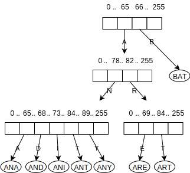
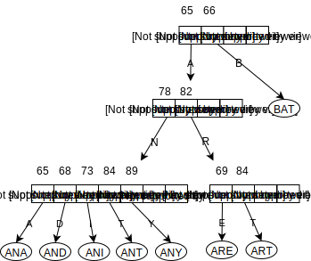
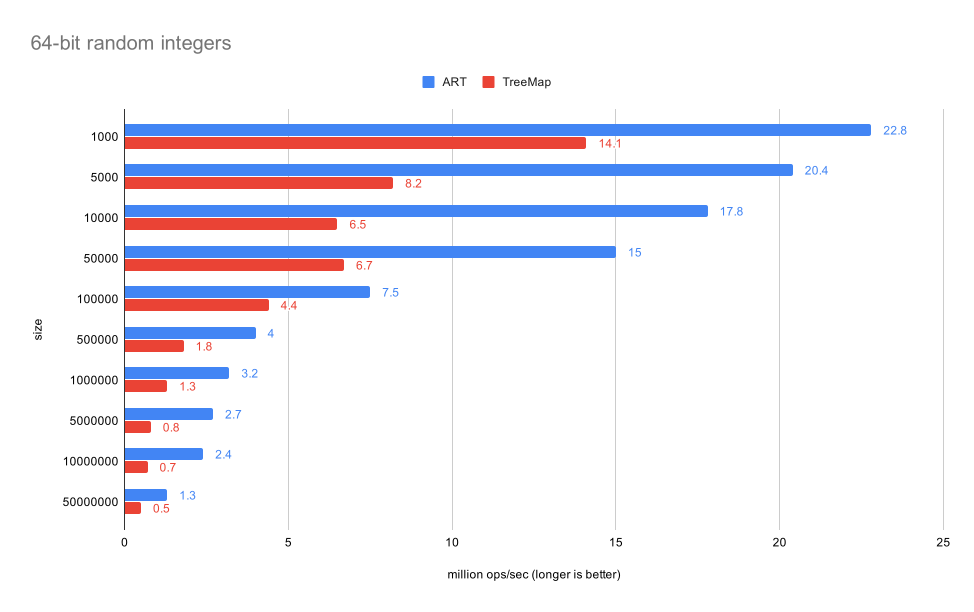
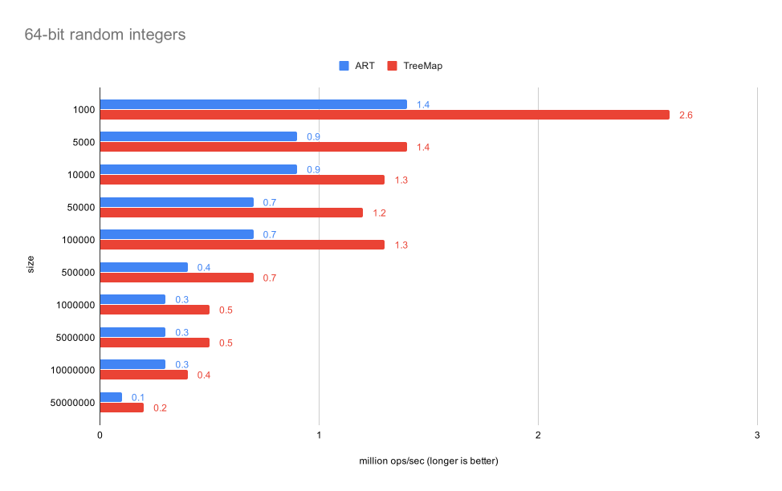

## Adaptive Radix Tree implemented as a Java NavigableMap
[](https://travis-ci.org/rohansuri/adaptive-radix-tree)
[](https://codecov.io/gh/rohansuri/adaptive-radix-tree)

This library provides an implementation of Adaptive Radix Tree (ART) as a [Java NavigableMap](https://docs.oracle.com/en/java/javase/12/docs/api/java.base/java/util/NavigableMap.html) based on the ICDE 2013 [paper](https://db.in.tum.de/~leis/papers/ART.pdf) "The Adaptive Radix Tree: ARTful Indexing for Main-Memory Databases" by Viktor Leis.

In the space of ordered data structures, [Radix trees](https://en.wikipedia.org/wiki/Radix_tree) are particularly interesting since their height and time complexity depends on key length (k) rather than number of keys (n) already present in the tree.  In the era of extremely large data sets, when n is growing faster than k, having a time complexity independent of n is very attractive.

*However*, they have always been plagued by the problem of excessive space consumption due to having a fixed number of children that every internal node has. 

ART solves this problem by adaptively changing the size of internal nodes depending on the number of children it actually has. As the number of children of an internal node increase/decrease, ART will grow/shrink the internal node into one of 4, 16, 48, 256 sizes.

For example, here's the result of storing some sample strings in both structures.

Where Radix Tree will have allocated space for 1024 pointers (4 nodes having 256 each), ART only requires 28 pointers (3 Node4 and 1 Node16). At 8-bytes per pointer, that's about 8K bytes saved.

|Radix Tree|Adaptive Radix Tree |
|------|------|
| | |

## Overview
*	`O(k)` put/get/remove time complexity where k is key length.
*	Implements [NavigableMap](https://docs.oracle.com/en/java/javase/12/docs/api/java.base/java/util/NavigableMap.html) and hence is a drop-in replacement for [TreeMap](https://docs.oracle.com/en/java/javase/12/docs/api/java.base/java/util/TreeMap.html).
*	Cache friendly because:
	*	Uses path compression and lazy leaf expansion to avoid single child paths thereby reducing pointer indirections which cause cache misses. These two techniques also reduce tree height.
	*	Compact nodes that are array backed and hence exhibit spatial locality, utilising cache lines better.

## Table of contents
- [Binary comparable keys](#binary-comparable-keys)
    + [Signed integers](#signed-integers)
    + [ASCII encoded character strings](#ascii-encoded-character-strings)
    + [IPv4 addresses](#ipv4-addresses)
    + [Further reading](#further-reading)
- [Usage](#usage)
  * [Simple keys based on primitives and String](#simple-keys-based-on-primitives-and-string)
  * [Compound keys](#compound-keys)
    + [With only fixed length attributes](#with-only-fixed-length-attributes)
    + [With variable length attributes](#with-variable-length-attributes)
- [Examples](#examples)
- [YCSB Benchmarks](#ycsb-benchmarks)
  * [Load (100% insert)](#load-100-insert)
  * [C (100% lookup)](#c-100-lookup)
  * [E (95% range scan, 5% lookup)](#e-95-range-scan-5-insert)
- [Tests](#tests)


## Binary comparable keys

For using ART, the keys need to be transformed into binary comparable keys which are the byte array representation of your keys such that the result of doing lexicographic comparison over them is the same as doing the key comparison.

#### Signed integers 
Signed integers are stored in two's complement notation. This means that negative integers always have their MSB set and hence are bitwise lexicographically greater than positive integers. 

For example -1 in 2's complement form is 1111 1111 1111 1111 1111 1111 1111 1111, whereas +1 is 0000 0000 0000 0000 0000 0000 0000 0001.

This is not the correct binary comparable transformation since +1 > -1 but the above transformation lexicographically orders +1 before -1.

In this case, the right transformation is obtained by flipping the sign bit.

Therefore -1 will be 0111 1111 1111 1111 1111 1111 1111 1111 and +1 as 1000 0000 0000 0000 0000 0000 0000 0001.

#### ASCII encoded character strings
Naturally yield the expected order as 'a' < 'b' and their respective byte values 97 < 98 obey the order.

#### IPv4 addresses
Naturally yield the expected order since each octet is an unsigned byte and unsigned types in binary have the expected lexicographic ordering.

For example, 12.10.192.0 < 12.10.199.255 and their respective binary representation 00001100.00001010.11000000.00000000 is lexicographically smaller than 00001100.00001010.11000111.11111111.


#### Further reading
Section IV of the [paper](https://db.in.tum.de/~leis/papers/ART.pdf).

## Usage

An implementation of the following interface is required for the map key:

```java

public interface BinaryComparable<K> {
	byte[] get(K key);
}

```

### Simple keys based on primitives and String

`BinaryComparables` already provides the key transformations for primitives and Strings.

```java

NavigableMap<String, Value> arts = new AdaptiveRadixTree(BinaryComparables.forString());
NavigableMap<Integer, Value> arti = new AdaptiveRadixTree(BinaryComparables.forInteger());

```

[This](examples/ip-lookup/src/main/java/com/github/rohansuri/art/examples/ip/lookup/InetAddressBinaryComparable.java) example shows the transformation for 32-bit [InetAddress](https://docs.oracle.com/en/java/javase/12/docs/api/java.base/java/net/InetAddress.html) which is internally stored as a integer.

### Compound keys

#### With only fixed length attributes
Transform each attribute separately and concatenate the results. 

[This](examples/api-versioning/src/main/java/com/github/rohansuri/art/examples/api/versioning/APIVersionBinaryComparable.java) example shows the transformation for a compound key made up of two integers.

#### With variable length attributes
Transformation of a variable length attribute that is succeeded by another attribute is required to end with a byte 0 for the right transformation. Without it, compound key ("a", "bc") and ("ab", "c") would be incorrectly treated equal. **Note** this only works if byte 0 is not part of the variable length attribute's key space, otherwise ("a\0", "b") would be incorrectly ordered before ("a", "b").

If byte 0 is part of the key space then the key transformation requires remapping every byte 0 as byte 0 followed by byte 1 and ending with two byte 0s. This is described in section IV.B (e).

## Examples
Check the [examples directory](examples).

## YCSB Benchmarks

Refer [YCSB](https://github.com/brianfrankcooper/YCSB/wiki/Core-Workloads) for workload characteristics.

|Configuration|Value|
|----|----|
| Processor | Intel i7-8750H CPU @ 2.20GHz |
| JVM | Oracle JDK build 12.0.1+12 |
| OS | MacOS Mojave 10.14.4 |
| Memory | 16 GB |
| L1, L2, L3 cache sizes | 32K, 262K, 9MB |


### Load (100% insert)


### C (100% lookup)



### E (95% range scan, 5% insert)




#### Running benchmarks
```
gradle --no-daemon clean jmh
```

## Tests

Compliance of ART to SortedMap interface has been tested by running it against [Apache Common Collection's suite of tests](https://github.com/apache/commons-collections/blob/master/src/test/java/org/apache/commons/collections4/map/AbstractSortedMapTest.java).

Additionally this project extends that suite by including NavigableMap specific tests (something that can be contributed upstream).

#### Running tests
```
gradle test testJUnit4
```
